# Diagram Architektury Autentykacji - FlashCard AI

## Przegląd

Ten diagram przedstawia pełny cykl życia procesu autentykacji w aplikacji FlashCard AI, wykorzystującej React 19, Astro 5 i Supabase Auth. Diagram wizualizuje kluczowe przepływy: rejestrację, logowanie, ochronę ścieżek, automatyczne odświeżanie tokenów oraz wylogowanie.

## Kluczowi Aktorzy

- **Przeglądarka** - Inicjuje żądania użytkownika, renderuje formularze, przechowuje sesję w ciasteczkach
- **Middleware Astro** - Przechwytuje żądania, zarządza sesjami, chroni ścieżki, odświeża tokeny
- **Astro Actions** - Obsługuje logikę serwerową dla operacji autentykacji
- **Supabase Auth** - Provider tożsamości, zarządza użytkownikami i tokenami JWT
- **PostgreSQL** - Przechowuje dane użytkowników i profile

## Diagram Sekwencji

```mermaid
sequenceDiagram
    autonumber
    participant Browser as Przeglądarka
    participant Middleware as Middleware Astro
    participant Actions as Astro Actions
    participant SupabaseAuth as Supabase Auth
    participant DB as PostgreSQL

    Note over Browser,DB: Przepływ Rejestracji (US-001)
    
    Browser->>Browser: Użytkownik wypełnia formularz rejestracji
    Browser->>Browser: React waliduje dane (Zod)
    Browser->>Actions: POST /register (email, hasło)
    activate Actions
    Actions->>Actions: Walidacja schematu Zod
    Actions->>SupabaseAuth: signUp(email, hasło)
    activate SupabaseAuth
    
    alt Rejestracja pomyślna
        SupabaseAuth->>DB: INSERT INTO auth.users
        activate DB
        DB->>DB: Trigger: INSERT INTO public.profiles
        DB-->>SupabaseAuth: Użytkownik utworzony
        deactivate DB
        SupabaseAuth-->>Actions: Sesja (access + refresh token)
        Actions->>Actions: Ustaw ciasteczka sesji
        Actions-->>Browser: Sukces + przekierowanie
        Browser->>Browser: Przekierowanie do /app/generate
    else Rejestracja nieudana
        SupabaseAuth-->>Actions: Błąd (np. email już istnieje)
        Actions-->>Browser: Komunikat błędu
        Browser->>Browser: Wyświetl komunikat użytkownikowi
    end
    deactivate SupabaseAuth
    deactivate Actions

    Note over Browser,DB: Przepływ Logowania (US-002)
    
    Browser->>Browser: Użytkownik wypełnia formularz logowania
    Browser->>Browser: React waliduje dane
    Browser->>Actions: POST /login (email, hasło)
    activate Actions
    Actions->>SupabaseAuth: signInWithPassword(credentials)
    activate SupabaseAuth
    
    alt Logowanie pomyślne
        SupabaseAuth->>DB: Weryfikacja użytkownika
        activate DB
        DB-->>SupabaseAuth: Użytkownik zweryfikowany
        deactivate DB
        SupabaseAuth-->>Actions: Sesja (tokeny)
        Actions->>Actions: Ustaw ciasteczka sesji
        Actions-->>Browser: Sukces + przekierowanie
        Browser->>Browser: Przekierowanie do /app/decks
    else Nieprawidłowe dane logowania
        SupabaseAuth-->>Actions: Błąd autentykacji
        Actions-->>Browser: Komunikat błędu
        Browser->>Browser: Wyświetl komunikat użytkownikowi
    end
    deactivate SupabaseAuth
    deactivate Actions

    Note over Browser,DB: Ochrona Route i Odświeżanie Tokenu
    
    Browser->>Middleware: GET /app/decks
    activate Middleware
    Middleware->>Middleware: Tworzenie ServerClient (SSR)
    Middleware->>SupabaseAuth: getSession()
    activate SupabaseAuth
    
    alt Token aktualny
        SupabaseAuth-->>Middleware: Aktualna sesja + dane user
        Middleware->>Middleware: Zapisz user w Astro.locals
        Middleware-->>Browser: Kontynuuj do /app/decks
        Browser->>Browser: Renderuj chroniony zasób
    else Token wygasł, ale refresh token ważny
        SupabaseAuth->>SupabaseAuth: Użyj refresh token
        SupabaseAuth->>DB: Weryfikuj refresh token
        activate DB
        DB-->>SupabaseAuth: Token ważny
        deactivate DB
        SupabaseAuth->>SupabaseAuth: Generuj nowy access token
        SupabaseAuth-->>Middleware: Nowa sesja
        Middleware->>Middleware: Aktualizuj ciasteczka w odpowiedzi
        Middleware->>Middleware: Zapisz user w Astro.locals
        Middleware-->>Browser: Kontynuuj + nowe ciasteczka
        Browser->>Browser: Renderuj zasób
    else Brak sesji lub refresh token wygasł
        SupabaseAuth-->>Middleware: Brak sesji
        Middleware-->>Browser: Przekierowanie do /login
        Browser->>Browser: Wyświetl formularz logowania
    end
    deactivate SupabaseAuth
    deactivate Middleware

    Note over Browser,DB: Dodatkowa Ochrona: Przekierowanie Zalogowanych
    
    Browser->>Middleware: GET /login (użytkownik już zalogowany)
    activate Middleware
    Middleware->>SupabaseAuth: getSession()
    activate SupabaseAuth
    
    alt Użytkownik zalogowany
        SupabaseAuth-->>Middleware: Sesja istnieje
        Middleware-->>Browser: Przekierowanie do /app/decks
        Browser->>Browser: Wyświetl panel główny
    else Użytkownik niezalogowany
        SupabaseAuth-->>Middleware: Brak sesji
        Middleware-->>Browser: Kontynuuj do /login
        Browser->>Browser: Wyświetl formularz logowania
    end
    deactivate SupabaseAuth
    deactivate Middleware

    Note over Browser,DB: Przepływ Wylogowania
    
    Browser->>Browser: Użytkownik klika "Wyloguj"
    Browser->>Actions: POST /logout
    activate Actions
    Actions->>SupabaseAuth: signOut()
    activate SupabaseAuth
    SupabaseAuth->>DB: Unieważnij refresh token
    activate DB
    DB-->>SupabaseAuth: Token unieważniony
    deactivate DB
    SupabaseAuth-->>Actions: Wylogowanie pomyślne
    deactivate SupabaseAuth
    Actions->>Actions: Usuń ciasteczka sesji
    Actions-->>Browser: Sukces + przekierowanie
    deactivate Actions
    Browser->>Browser: Przekierowanie do /login
```

## Kluczowe Mechanizmy Bezpieczeństwa

### 1. Zarządzanie Sesjami
- Tokeny przechowywane w **HTTP-only cookies** (niedostępne dla JavaScript)
- **Access token** (krótkotrwały) + **Refresh token** (długotrwały)
- Automatyczne odświeżanie tokenów przez middleware

### 2. Ochrona Ścieżek
- Middleware chroni wszystkie ścieżki `/app/*`
- Przekierowania dla niezalogowanych użytkowników do `/login`
- Przekierowania dla zalogowanych użytkowników z `/login` i `/register` do `/app/decks`

### 3. Walidacja
- **Client-side**: React Hook Form + Zod (walidacja formatu)
- **Server-side**: Astro Actions + Zod (walidacja bezpieczeństwa)
- Podwójna warstwa walidacji zapobiega atakom

### 4. Trigger Bazodanowy
- Automatyczne tworzenie profilu w `public.profiles` po rejestracji
- Zapewnia spójność danych bez dodatkowych wywołań API

## Szczegóły Techniczne

| Komponent | Technologia | Odpowiedzialność |
|-----------|-------------|------------------|
| **Middleware** | Astro + @supabase/ssr | Zarządzanie ciasteczkami, odświeżanie tokenów, ochrona ścieżek |
| **Actions** | Astro Actions | Logika serwerowa dla auth operacji |
| **Formularze** | React 19 + Hook Form | Walidacja client-side, feedback UI |
| **Walidacja** | Zod | Schematy dzielone między klientem a serwerem |
| **Baza Danych** | PostgreSQL (Supabase) | Przechowywanie użytkowników i profili |
| **Auth Provider** | Supabase Auth | Provider tożsamości (IDP) |

## Powiązane User Stories

- **US-001**: Rejestracja nowego użytkownika
- **US-002**: Logowanie do systemu

## Changelog

- **2026-01-18**: Inicjalna wersja diagramu architektury autentykacji
