# Diagram Podróży Użytkownika - FlashCard AI

Poniższy diagram przedstawia kompleksową podróż użytkownika w aplikacji FlashCard AI, obejmującą procesy autentykacji, generowania fiszek, zarządzania i nauki.

```mermaid
stateDiagram-v2
    [*] --> StronaGlowna

    state "Strona Główna" as StronaGlowna
    note right of StronaGlowna
        Landing page aplikacji
        Użytkownik może:
        - Zalogować się
        - Zarejestrować nowe konto
    end note

    state decyzja_konto <<choice>>
    StronaGlowna --> decyzja_konto: Użytkownik wybiera akcję
    decyzja_konto --> ProcesRejestracji: Brak konta
    decyzja_konto --> ProcesLogowania: Posiadam konto

    state "Proces Rejestracji" as ProcesRejestracji {
        [*] --> FormularzRejestracji
        
        state "Formularz Rejestracji" as FormularzRejestracji
        note right of FormularzRejestracji
            US-001: Rejestracja nowego użytkownika
            Pola: Email, Hasło, Potwierdzenie hasła
            Walidacja: React Hook Form + Zod
        end note
        
        FormularzRejestracji --> WalidacjaRejestracji: Wysłanie formularza
        
        state walidacja_rej <<choice>>
        WalidacjaRejestracji --> walidacja_rej
        walidacja_rej --> FormularzRejestracji: Błędne dane
        walidacja_rej --> TworzenieKonta: Dane poprawne
        
        state "Tworzenie Konta" as TworzenieKonta
        note right of TworzenieKonta
            1. Wywołanie auth.register
            2. Supabase tworzy użytkownika
            3. Trigger tworzy profil
        end note
        
        TworzenieKonta --> AutomatyczneLogowanie
        
        state "Automatyczne Logowanie" as AutomatyczneLogowanie
        note right of AutomatyczneLogowanie
            Użytkownik jest automatycznie
            zalogowany po rejestracji
        end note
        
        AutomatyczneLogowanie --> [*]
    }

    state "Proces Logowania" as ProcesLogowania {
        [*] --> FormularzLogowania
        
        state "Formularz Logowania" as FormularzLogowania
        note right of FormularzLogowania
            US-002: Logowanie do systemu
            Pola: Email, Hasło
            Linki: Zapomniałem hasła, Utwórz konto
        end note
        
        FormularzLogowania --> WalidacjaLogowania: Wysłanie formularza
        
        state walidacja_log <<choice>>
        WalidacjaLogowania --> walidacja_log
        walidacja_log --> FormularzLogowania: Niepoprawne dane
        walidacja_log --> TworzenieSesji: Dane poprawne
        
        state "Tworzenie Sesji" as TworzenieSesji
        note right of TworzenieSesji
            1. Wywołanie auth.login
            2. Supabase weryfikuje
            3. Utworzenie access + refresh token
            4. Ustawienie cookies
        end note
        
        TworzenieSesji --> [*]
    }

    ProcesRejestracji --> Middleware: Po rejestracji
    ProcesLogowania --> Middleware: Po logowaniu

    state "Middleware - Ochrona Tras" as Middleware {
        [*] --> SprawdzenieTokenu
        
        state "Sprawdzenie Tokenu" as SprawdzenieTokenu
        note right of SprawdzenieTokenu
            Middleware sprawdza sesję
            dla każdego żądania /app/*
        end note
        
        state token_check <<choice>>
        SprawdzenieTokenu --> token_check
        
        state "Odświeżenie Tokenu" as OdswiezenieTokenu
        token_check --> OdswiezenieTokenu: Token wygasł
        token_check --> [*]: Token aktualny
        token_check --> StronaGlowna: Brak tokenu
        
        OdswiezenieTokenu --> [*]: Odświeżono pomyślnie
        OdswiezenieTokenu --> StronaGlowna: Refresh token wygasł
    }

    Middleware --> PanelAplikacji: Dostęp autoryzowany

    state "Panel Aplikacji" as PanelAplikacji {
        [*] --> historia
        state historia <<history>>
        
        state fork_start <<fork>>
        historia --> fork_start
        
        fork_start --> GeneratorFiszek
        fork_start --> BibliotekaTalii
        fork_start --> SesjaNauki
        
        state "Generator Fiszek" as GeneratorFiszek {
            [*] --> WidokGeneratora
            
            state "Widok Generatora" as WidokGeneratora
            note right of WidokGeneratora
                US-003: Generowanie fiszek z tekstu
                Pole tekstowe: max 5000 znaków
                Wyświetlanie licznika limitów
            end note
            
            WidokGeneratora --> SprawdzenieLimitu: Wysłanie tekstu
            
            state limit_check <<choice>>
            SprawdzenieLimitu --> limit_check
            limit_check --> WidokGeneratora: Limit przekroczony (10/dzień)
            limit_check --> GenerowanieAI: Limit OK
            
            state "Generowanie AI" as GenerowanieAI
            note right of GenerowanieAI
                1. Wywołanie OpenAI GPT-4o-mini
                2. Przetwarzanie tekstu
                3. Generowanie par przód/tył
            end note
            
            GenerowanieAI --> Poczekalnia
            
            state "Poczekalnia" as Poczekalnia {
                [*] --> ListaFiszek
                
                state "Lista Fiszek" as ListaFiszek
                note right of ListaFiszek
                    US-004: Weryfikacja fiszek
                    Każda fiszka ma opcje:
                    - Akceptuj
                    - Edytuj
                    - Odrzuć
                end note
                
                state akcja_fiszka <<choice>>
                ListaFiszek --> akcja_fiszka: Akcja użytkownika
                
                akcja_fiszka --> EdycjaFiszki: Edytuj
                akcja_fiszka --> OdrzucenieFiszki: Odrzuć
                akcja_fiszka --> AkceptacjaFiszek: Akceptuj
                
                state "Edycja Fiszki" as EdycjaFiszki
                note right of EdycjaFiszki
                    US-005: Edycja w poczekalni
                    Możliwość poprawy przodu i tyłu
                end note
                
                EdycjaFiszki --> ListaFiszek: Zapisz zmiany
                
                state "Odrzucenie Fiszki" as OdrzucenieFiszki
                OdrzucenieFiszki --> ListaFiszek: Usuń z listy
                
                state "Akceptacja Fiszek" as AkceptacjaFiszek
                note right of AkceptacjaFiszek
                    US-006: Zapisanie do talii
                    Fiszki zapisywane w bazie
                    Status: do nauki (SM-2)
                end note
                
                AkceptacjaFiszek --> [*]
            }
            
            Poczekalnia --> [*]: Zakończono weryfikację
        }

        state "Biblioteka Talii" as BibliotekaTalii {
            [*] --> WidokBiblioteki
            
            state "Widok Biblioteki" as WidokBiblioteki
            note right of WidokBiblioteki
                Lista wszystkich talii użytkownika
                Opcje: Utwórz nową talię
                Wyszukiwanie i filtrowanie
            end note
            
            WidokBiblioteki --> SzczegolyTalii: Wybór talii
            WidokBiblioteki --> TworzenieNowejTalii: Nowa talia
            
            state "Tworzenie Nowej Talii" as TworzenieNowejTalii
            TworzenieNowejTalii --> WidokBiblioteki: Zapisano
            
            state "Szczegóły Talii" as SzczegolyTalii {
                [*] --> ListaFiszekTalii
                
                state "Lista Fiszek w Talii" as ListaFiszekTalii
                note right of ListaFiszekTalii
                    US-008: Zarządzanie talią
                    Wyświetlanie wszystkich fiszek
                    Opcje: Dodaj, Edytuj, Usuń
                end note
                
                ListaFiszekTalii --> DodawanieFiszki: Dodaj nową
                ListaFiszekTalii --> EdycjaFiszkiTalii: Edytuj istniejącą
                ListaFiszekTalii --> UsuwanieFiszki: Usuń
                
                state "Dodawanie Fiszki" as DodawanieFiszki
                note right of DodawanieFiszki
                    US-007: Ręczne dodawanie
                    Formularz: Przód i Tył
                    Walidacja: Pola nie mogą być puste
                end note
                
                DodawanieFiszki --> ListaFiszekTalii: Zapisano
                
                state "Edycja Fiszki w Talii" as EdycjaFiszkiTalii
                EdycjaFiszkiTalii --> ListaFiszekTalii: Zapisano zmiany
                
                state "Usuwanie Fiszki" as UsuwanieFiszki
                note right of UsuwanieFiszki
                    Wymagane potwierdzenie
                    Usunięcie nieodwracalne
                end note
                
                UsuwanieFiszki --> ListaFiszekTalii: Usunięto
                
                ListaFiszekTalii --> [*]: Powrót do biblioteki
            }
            
            SzczegolyTalii --> WidokBiblioteki: Powrót
            WidokBiblioteki --> [*]
        }

        state "Sesja Nauki" as SesjaNauki {
            [*] --> PobieranieKolejki
            
            state "Pobieranie Kolejki" as PobieranieKolejki
            note right of PobieranieKolejki
                Algorytm SM-2 wyznacza fiszki
                do powtórki na dzisiaj
            end note
            
            state kolejka_check <<choice>>
            PobieranieKolejki --> kolejka_check
            kolejka_check --> PodsumowanieSesji: Brak fiszek
            kolejka_check --> WyswietleniePrzodu: Fiszki dostępne
            
            state "Wyświetlenie Przodu" as WyswietleniePrzodu
            note right of WyswietleniePrzodu
                US-009: Sesja nauki
                Wyświetlany tylko przód fiszki
                Przycisk: Pokaż odpowiedź
                Zoptymalizowane pod mobile
            end note
            
            WyswietleniePrzodu --> WyswietlenieTylu: Pokaż odpowiedź
            
            state "Wyświetlenie Tyłu" as WyswietlenieTylu
            note right of WyswietlenieTylu
                Widoczny tył fiszki
                4 przyciski oceny:
                Again, Hard, Good, Easy
            end note
            
            WyswietlenieTylu --> OcenaFiszki: Wybór trudności
            
            state "Ocena Fiszki" as OcenaFiszki
            note right of OcenaFiszki
                US-010: Ocena znajomości
                Aktualizacja parametrów SM-2:
                - Easiness Factor
                - Interval
                - Repetitions
                - Next Review Date
            end note
            
            state nastepna_fiszka <<choice>>
            OcenaFiszki --> nastepna_fiszka
            nastepna_fiszka --> WyswietleniePrzodu: Kolejna fiszka
            nastepna_fiszka --> PodsumowanieSesji: Koniec kolejki
            
            state "Podsumowanie Sesji" as PodsumowanieSesji
            note right of PodsumowanieSesji
                US-011: Podsumowanie
                Wyświetlenie statystyk
                Komunikat zachęcający do powrotu
                Przycisk: Wróć do panelu
            end note
            
            PodsumowanieSesji --> [*]
        }
        
        state join_end <<join>>
        GeneratorFiszek --> join_end
        BibliotekaTalii --> join_end
        SesjaNauki --> join_end
        
        join_end --> WylogowanieProces: Wyloguj
        
        state "Proces Wylogowania" as WylogowanieProces {
            [*] --> WywołanieWylogowania
            
            state "Wywołanie Wylogowania" as WywołanieWylogowania
            note right of WywołanieWylogowania
                1. Wywołanie auth.logout
                2. Supabase unieważnia tokeny
                3. Usunięcie cookies
            end note
            
            WywołanieWylogowania --> [*]
        }
        
        WylogowanieProces --> [*]
    }

    PanelAplikacji --> StronaGlowna: Po wylogowaniu
    StronaGlowna --> [*]: Opuszczenie aplikacji
```

## Kluczowe punkty podróży użytkownika:

### 1. Autentykacja
- **Rejestracja (US-001)**: Nowy użytkownik tworzy konto i jest automatycznie zalogowany
- **Logowanie (US-002)**: Powracający użytkownik uzyskuje dostęp do aplikacji
- **Middleware**: Automatyczna ochrona tras i odświeżanie tokenów

### 2. Główne funkcje aplikacji

#### Generator Fiszek (US-003 - US-006)
- Wprowadzenie tekstu źródłowego (max 5000 znaków)
- Sprawdzenie limitu dziennego (10 zapytań)
- Generowanie przez AI (GPT-4o-mini)
- Weryfikacja w Poczekalni (akceptuj/edytuj/odrzuć)
- Zapisanie do talii

#### Biblioteka i Zarządzanie (US-007 - US-008)
- Przeglądanie talii
- Dodawanie fiszek ręcznie
- Edycja istniejących fiszek
- Usuwanie fiszek

#### Sesja Nauki (US-009 - US-011)
- Algorytm SM-2 wyznacza kolejkę
- Wyświetlanie przodu i tyłu fiszki
- Ocena trudności (Again/Hard/Good/Easy)
- Aktualizacja harmonogramu powtórek
- Podsumowanie sesji

### 3. Bezpieczeństwo i UX
- Middleware chroni wszystkie trasy `/app/*`
- Automatyczne odświeżanie wygasłych tokenów
- Walidacja danych na poziomie klienta i serwera
- Przekierowania zapobiegające błędnym ścieżkom
- Zoptymalizowany interfejs pod urządzenia mobilne

### 4. Przepływy decyzyjne
- **Strona główna**: Wybór między logowaniem a rejestracją
- **Walidacja formularzy**: Weryfikacja danych przed wysłaniem
- **Sprawdzenie limitu**: Ochrona przed nadużyciem API AI
- **Poczekalnia**: Weryfikacja jakości wygenerowanych fiszek
- **Kolejka nauki**: Sprawdzenie dostępności fiszek do powtórki
- **Middleware**: Automatyczne zarządzanie sesjami i przekierowania
