# Diagram Architektury UI - FlashCard AI MVP

## Przegląd

Ten diagram przedstawia kompleksową architekturę UI aplikacji FlashCard AI po wdrożeniu systemu autentykacji. Diagram uwzględnia zarówno istniejące komponenty aplikacyjne, jak i nowe komponenty związane z modułem logowania i rejestracji.

## Legenda

- **Prostokąty** - Strony Astro i Komponenty React
- **Romby** - Punkty decyzyjne (middleware, routing)
- **Zaokrąglone Prostokąty** - Usługi i warstwy logiki biznesowej
- **Grupy (Subgrafy)** - Moduły funkcjonalne

---

## Diagram Mermaid

```mermaid
flowchart TD
    %% =====================================
    %% WARSTWA WEJŚCIOWA - ROUTING
    %% =====================================
    
    Browser[Przeglądarka Użytkownika]
    
    subgraph "Routing i Middleware"
        Router{Astro Router}
        Middleware{Middleware<br/>Ochrona Tras + Sesja}
        
        Router --> Middleware
    end
    
    %% =====================================
    %% MODUŁ AUTENTYKACJI - NOWY
    %% =====================================
    
    subgraph "Moduł Autentykacji"
        direction TB
        
        subgraph "Layouts Autentykacji"
            AuthLayout[AuthLayout.astro<br/>Layout dla Auth]
        end
        
        subgraph "Strony Autentykacji"
            LoginPage[login.astro<br/>Strona Logowania]
            RegisterPage[register.astro<br/>Strona Rejestracji]
        end
        
        subgraph "Komponenty React - Auth"
            LoginForm[LoginForm.tsx<br/>Formularz Logowania]
            RegisterForm[RegisterForm.tsx<br/>Formularz Rejestracji]
        end
        
        subgraph "Logika Server-Side"
            AuthActions[Astro Actions<br/>auth.login<br/>auth.register<br/>auth.logout]
            AuthValidator[auth.validator.ts<br/>Walidacja Zod]
        end
        
        LoginPage --> AuthLayout
        RegisterPage --> AuthLayout
        
        AuthLayout --> LoginForm
        AuthLayout --> RegisterForm
        
        LoginForm --> AuthValidator
        RegisterForm --> AuthValidator
        
        LoginForm --> AuthActions
        RegisterForm --> AuthActions
    end
    
    %% =====================================
    %% MODUŁ APLIKACJI - ISTNIEJĄCY
    %% =====================================
    
    subgraph "Moduł Aplikacji Chronionej"
        direction TB
        
        subgraph "Layout Aplikacji"
            AppLayout[Layout.astro<br/>Główny Layout]
        end
        
        subgraph "Strony Aplikacji"
            IndexPage[index.astro<br/>Strona Główna]
            DecksPage[app/decks.astro<br/>Biblioteka Talii]
            DeckDetailsPage[app/decks/id.astro<br/>Szczegóły Talii]
            GeneratePage[app/generate.astro<br/>Generator AI]
        end
        
        subgraph "Komponenty React - Aplikacja"
            Welcome[Welcome.astro<br/>Ekran Powitalny]
            DecksLibrary[DecksLibrary.tsx<br/>Zarządzanie Taliami]
            DeckDetailsView[DeckDetailsView.tsx<br/>Widok Szczegółów Talii]
            GeneratorPage[GeneratorPage.tsx<br/>Generator Fiszek AI]
        end
        
        subgraph "Moduł Decks"
            DeckGrid[DeckGrid.tsx]
            DeckCard[DeckCard.tsx]
            SearchFilter[SearchFilter.tsx]
            CreateDeckModal[CreateDeckModal.tsx]
            CreateDeckButton[CreateDeckButton.tsx]
        end
        
        subgraph "Moduł Deck Details"
            DeckHeader[DeckHeader.tsx]
            FlashcardList[FlashcardList.tsx]
            FlashcardItem[FlashcardItem.tsx]
            AddCardButton[AddCardButton.tsx]
            CardFormDrawer[CardFormDrawer.tsx]
            DeleteConfirmation[DeleteConfirmationDialog.tsx]
        end
        
        subgraph "Moduł Generator"
            SourceInput[SourceInput.tsx<br/>Pole Tekstowe]
            QuotaIndicator[QuotaIndicator.tsx<br/>Limit Generacji]
            StagingArea[StagingArea.tsx<br/>Poczekalnia]
            FlashcardPreview[FlashcardPreviewCard.tsx]
            ActionToolbar[ActionToolbar.tsx]
            DeckSelectionModal[DeckSelectionModal.tsx]
        end
        
        IndexPage --> AppLayout
        DecksPage --> AppLayout
        DeckDetailsPage --> AppLayout
        GeneratePage --> AppLayout
        
        AppLayout --> Welcome
        AppLayout --> DecksLibrary
        AppLayout --> DeckDetailsView
        AppLayout --> GeneratorPage
        
        DecksLibrary --> DeckGrid
        DecksLibrary --> SearchFilter
        DecksLibrary --> CreateDeckButton
        DeckGrid --> DeckCard
        CreateDeckButton --> CreateDeckModal
        
        DeckDetailsView --> DeckHeader
        DeckDetailsView --> FlashcardList
        DeckDetailsView --> AddCardButton
        FlashcardList --> FlashcardItem
        AddCardButton --> CardFormDrawer
        FlashcardItem --> CardFormDrawer
        DeckHeader --> DeleteConfirmation
        
        GeneratorPage --> SourceInput
        GeneratorPage --> QuotaIndicator
        GeneratorPage --> StagingArea
        GeneratorPage --> ActionToolbar
        StagingArea --> FlashcardPreview
        ActionToolbar --> DeckSelectionModal
    end
    
    %% =====================================
    %% KOMPONENTY WSPÓŁDZIELONE
    %% =====================================
    
    subgraph "Komponenty UI Współdzielone"
        direction LR
        Button[button.tsx]
        Input[input.tsx]
        Dialog[dialog.tsx]
        DropdownMenu[dropdown-menu.tsx]
        Skeleton[skeleton.tsx]
    end
    
    %% =====================================
    %% WARSTWA USŁUG I API
    %% =====================================
    
    subgraph "Warstwa Usług Backend"
        direction TB
        
        subgraph "API Endpoints"
            DecksAPI[api/decks]
            FlashcardsAPI[api/flashcards]
            GenerateAPI[api/generate-flashcards]
            ProfileAPI[api/profile]
            StudyAPI[api/study]
        end
        
        subgraph "Usługi Biznesowe"
            DeckService[deck.service.ts]
            FlashcardService[flashcard.service.ts]
            OpenAIService[openai.service.ts]
            ProfileService[profile.service.ts]
            QuotaService[quota.service.ts]
            StudyService[study.service.ts]
        end
        
        subgraph "Walidatory"
            DeckValidator[deck.validator.ts]
            FlashcardValidator[flashcard.validator.ts]
            GenerateValidator[generate-flashcards.validator.ts]
            StudyValidator[study.validator.ts]
        end
        
        DecksAPI --> DeckService
        FlashcardsAPI --> FlashcardService
        GenerateAPI --> OpenAIService
        ProfileAPI --> ProfileService
        StudyAPI --> StudyService
        
        DeckService --> DeckValidator
        FlashcardService --> FlashcardValidator
        OpenAIService --> GenerateValidator
        StudyService --> StudyValidator
    end
    
    %% =====================================
    %% WARSTWA DANYCH
    %% =====================================
    
    subgraph "Warstwa Danych"
        direction TB
        SupabaseClient[supabase.client.ts<br/>Klient Supabase]
        DatabaseTypes[database.types.ts<br/>Typy TypeScript]
        SharedTypes[types.ts<br/>DTOs i Entities]
        
        SupabaseAuth[Supabase Auth<br/>Zarządzanie Tożsamością]
        SupabaseDB[(Supabase Database<br/>PostgreSQL)]
        
        SupabaseClient --> SupabaseAuth
        SupabaseClient --> SupabaseDB
    end
    
    %% =====================================
    %% PRZEPŁYWY DANYCH - ROUTING
    %% =====================================
    
    Browser --> Router
    
    Middleware -->|Niezalogowany + /app/*| LoginPage
    Middleware -->|Zalogowany + /login| DecksPage
    Middleware -->|Zalogowany + /app/*| AppLayout
    Middleware -->|Niezalogowany + /| IndexPage
    
    %% =====================================
    %% PRZEPŁYWY DANYCH - AUTENTYKACJA
    %% =====================================
    
    AuthActions --> SupabaseAuth
    SupabaseAuth -->|Sukces| Middleware
    SupabaseAuth -->|Błąd| LoginForm
    SupabaseAuth -->|Błąd| RegisterForm
    
    %% =====================================
    %% PRZEPŁYWY DANYCH - APLIKACJA
    %% =====================================
    
    DecksLibrary --> DecksAPI
    DeckDetailsView --> DecksAPI
    DeckDetailsView --> FlashcardsAPI
    GeneratorPage --> GenerateAPI
    GeneratorPage --> QuotaService
    
    %% =====================================
    %% INTEGRACJA KOMPONENTÓW WSPÓŁDZIELONYCH
    %% =====================================
    
    LoginForm -.-> Button
    LoginForm -.-> Input
    RegisterForm -.-> Button
    RegisterForm -.-> Input
    
    CreateDeckModal -.-> Dialog
    CreateDeckModal -.-> Input
    CreateDeckModal -.-> Button
    
    CardFormDrawer -.-> Dialog
    CardFormDrawer -.-> Input
    CardFormDrawer -.-> Button
    
    DeckHeader -.-> DropdownMenu
    DeckHeader -.-> Button
    
    DecksLibrary -.-> Skeleton
    DeckDetailsView -.-> Skeleton
    
    %% =====================================
    %% PRZEPŁYWY DO BAZY DANYCH
    %% =====================================
    
    DeckService --> SupabaseClient
    FlashcardService --> SupabaseClient
    ProfileService --> SupabaseClient
    QuotaService --> SupabaseClient
    StudyService --> SupabaseClient
    
    %% =====================================
    %% STYLE DLA NOWYCH KOMPONENTÓW
    %% =====================================
    
    classDef newComponent fill:#90EE90,stroke:#2E7D32,stroke-width:3px,color:#000
    classDef updatedComponent fill:#FFD700,stroke:#F57C00,stroke-width:3px,color:#000
    classDef existingComponent fill:#E3F2FD,stroke:#1976D2,stroke-width:2px,color:#000
    
    class LoginPage,RegisterPage,LoginForm,RegisterForm,AuthLayout,AuthActions,AuthValidator newComponent
    class Middleware,AppLayout updatedComponent
    class IndexPage,DecksPage,DeckDetailsPage,GeneratePage,DecksLibrary,DeckDetailsView,GeneratorPage existingComponent
```



---

## Kluczowe Zmiany w Architekturze UI

### 1. Nowe Komponenty (Zielone)

Komponenty dodane w ramach implementacji modułu autentykacji:

- **AuthLayout.astro** - Dedykowany layout dla stron autentykacji (minimalistyczny, bez nawigacji)
- **login.astro / register.astro** - Strony SSR dla logowania i rejestracji
- **LoginForm.tsx / RegisterForm.tsx** - Interaktywne formularze React z walidacją
- **Astro Actions (auth.ts)** - Server-side logika dla operacji auth
- **auth.validator.ts** - Walidacja Zod współdzielona między klientem a serwerem

### 2. Zaktualizowane Komponenty (Żółte)

Komponenty wymagające modyfikacji ze względu na nowe wymagania:

- **Middleware (index.ts)** - Pełna przebudowa dla obsługi `@supabase/ssr`:
  - Zarządzanie ciasteczkami (access/refresh tokens)
  - Automatyczne odświeżanie sesji
  - Ochrona tras `/app/*`
  - Przekierowania dla zalogowanych/niezalogowanych użytkowników
  - Injection kontekstu (Astro.locals)

- **Layout.astro** - Potencjalne aktualizacje:
  - Wyświetlanie informacji o zalogowanym użytkowniku
  - Przycisk wylogowania
  - Nawigacja dostosowana do stanu sesji

### 3. Integracja z Istniejącym Ekosystemem

#### Przepływ Autentykacji:
1. Użytkownik wchodzi na `/login`
2. Middleware sprawdza sesję
3. Jeśli zalogowany → przekierowanie do `/app/decks`
4. Jeśli niezalogowany → renderowanie `LoginForm`
5. Po submit → `AuthActions` → `Supabase Auth`
6. Sukces → ustawienie ciasteczek → przekierowanie do `/app/generate`

#### Ochrona Tras:
- Middleware przechwytuje wszystkie requesty do `/app/*`
- Brak sesji → przekierowanie do `/login`
- Sesja wygasła → automatyczne odświeżenie lub wylogowanie

### 4. Współdzielone Komponenty UI

System wykorzystuje bibliotekę **Shadcn/ui** dla spójności wizualnej:

- `Button` - Używany w formularzach, akcjach CRUD
- `Input` - Pola tekstowe w LoginForm, RegisterForm, CreateDeckModal
- `Dialog` - Modale (CreateDeckModal, DeckSelectionModal)
- `Skeleton` - Loading states (DecksLibrary, DeckDetailsView)
- `DropdownMenu` - Akcje kontekstowe (DeckHeader)

### 5. Walidacja i Bezpieczeństwo

**Podwójna warstwa walidacji:**

- **Client-side**: React Hook Form + Zod
  - Natychmiastowy feedback dla użytkownika
  - Walidacja formatu (email, długość hasła)
  
- **Server-side**: Astro Actions + Zod
  - Zabezpieczenie przed omijaniem walidacji frontend
  - Użycie tych samych schematów Zod

### 6. Stan Aplikacji

**Zarządzanie stanem:**

- **Globalna sesja**: `Astro.locals` (user, supabase) - propagowana z middleware
- **Stan formularzy**: React Hook Form (LoginForm, RegisterForm)
- **Stan lokalny**: useState/useReducer (GeneratorPage, DeckDetailsView)
- **Optymistyczne aktualizacje**: useDecksLibrary, useDeckDetails

---

## Hierarchia Layouts

```
AuthLayout.astro (Minimalistyczny)
├── login.astro
│   └── LoginForm.tsx
└── register.astro
    └── RegisterForm.tsx

Layout.astro (Pełna nawigacja + sidebar)
├── index.astro
│   └── Welcome.astro
├── app/decks.astro
│   └── DecksLibrary.tsx
├── app/decks/[id].astro
│   └── DeckDetailsView.tsx
└── app/generate.astro
    └── GeneratorPage.tsx
```

---

## Routing i Ochrona Tras

| Ścieżka | Wymagana Sesja | Przekierowanie przy Braku Sesji | Przekierowanie gdy Zalogowany |
|---------|----------------|----------------------------------|-------------------------------|
| `/` | Nie | - | - |
| `/login` | Nie | - | `/app/decks` |
| `/register` | Nie | - | `/app/decks` |
| `/app/*` | **Tak** | `/login` | - |
| `/app/decks` | **Tak** | `/login` | - |
| `/app/generate` | **Tak** | `/login` | - |
| `/app/decks/[id]` | **Tak** | `/login` | - |

---

## Przepływ Danych - Przykład Generowania Fiszek

```
GeneratorPage (React)
  ↓
SourceInput → Walidacja (min 500 znaków)
  ↓
ActionToolbar → "Generate" (onClick)
  ↓
POST /api/generate-flashcards
  ↓
OpenAIService.generateFlashcards()
  ↓
GPT-4o-mini API
  ↓
Zwrot JSON z fiszkami
  ↓
StagingArea (Stan React)
  ↓
Użytkownik edytuje/akceptuje
  ↓
DeckSelectionModal (wybór talii)
  ↓
POST /api/flashcards (bulk create)
  ↓
FlashcardService.createMany()
  ↓
Supabase DB
  ↓
Przekierowanie → /app/decks/[deck_id]
```

---

## Notatki Implementacyjne

### Priorytet Wdrożenia:

1. **Faza 1**: Middleware + Astro Actions (Backend autentykacji)
2. **Faza 2**: AuthLayout + strony login/register (UI autentykacji)
3. **Faza 3**: LoginForm + RegisterForm + walidatory (Logika formularzy)
4. **Faza 4**: Aktualizacja Layout.astro (integracja z istniejącym UI)
5. **Faza 5**: Testy end-to-end (przepływy auth + chronione trasy)

### Zależności do Dodania:

```json
{
  "@supabase/ssr": "^0.1.0",
  "react-hook-form": "^7.49.0"
}
```

### Konfiguracja Supabase:

- Wyłączyć "Email Confirmations" (Auto-confirm ON) dla MVP
- Skonfigurować Redirect URL: `http://localhost:4321/auth/callback`
- Ustawić JWT expiry: 1h (access token), 7d (refresh token)

---

## Metryki UX po Wdrożeniu

### Cele:

- **Time to Interactive (TTI)** dla `/login`: < 1.5s
- **First Contentful Paint (FCP)** dla `/app/decks`: < 2s
- **Conversion Rate** (rejestracja → pierwsza fiszka): > 60%
- **Auth Error Rate**: < 5% (błędne dane vs problemy techniczne)

### Monitoring:

- Logowanie błędów auth w `generation_logs` (opcjonalnie)
- Tracking przekierowań (middleware metrics)
- Czas odpowiedzi Supabase Auth (latency monitoring)
